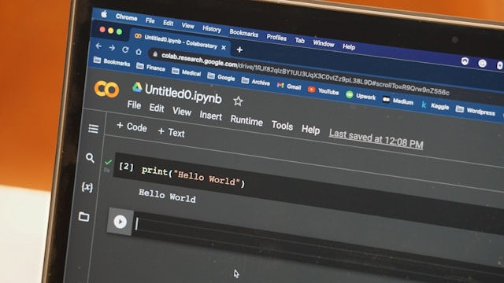

# Treinamento Basico

1. **[HTML/CSS](../treinamento-basico/src/html_css/)**
2. **[JavaScript](/src/javascript/)**
3. **[Markdown](/src/markdown/)**
4. **[Git](/src/git/)**
5. **[Docker](/src/docker/)**
6. **[Banco de dados](/src/banco_de_dados/)**
7. **[ElasticSearch](/src/elastic_search/)**
8. **[Java](/src/java/)**
9. **[Gradle](/src/gradle/)**
10. **[Servidores Web](/src/servidores_web/)**
11. **[Rest](/src/rest/)**
12. **[ReactJS](/src/reactjs/)**
13. **[Clay](/src/clay/)**
14. **[Liferay](/src/liferay/)**

## Tudo comecou com um 'Hello World!'...

